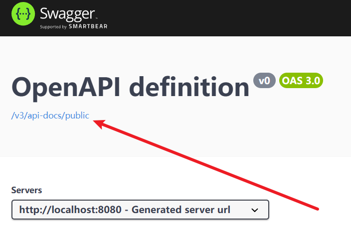
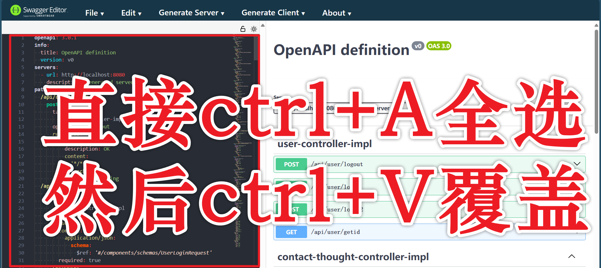

# Swagger使用指南

## 先运行上再说

> 我这里用的是spring3,如果你是用的spring2就不用往下看了，肯定用不了。

### 引依赖

在``pom.xml`中添加依赖

```xml
<dependency>
    <groupId>org.springdoc</groupId>
    <artifactId>springdoc-openapi-starter-webmvc-ui</artifactId>
    <version>2.2.0</version>
</dependency>
```

### 更改spring配置文件

```yml
spring:
  mvc:
    pathmatch:
      matching-strategy: ant_path_matcher
```

### 添加配置类

```JAVA
import org.springdoc.core.models.GroupedOpenApi;
import org.springframework.context.annotation.Bean;
import org.springframework.context.annotation.Configuration;

@Configuration
public class OpenApiConfig {
    @Bean
    public GroupedOpenApi publicApi() {
        return GroupedOpenApi.builder()
                .group("public")
                .packagesToScan("com.example.demo")
                .build();
    }
}

```

### 扩展-在文档中添加注释

你可以分别在类上和方法上通过添加注解，使生成的文档也包含注解中的内容。

|位置|注解名|解释|
|-|-|-|
|类上|`@Tag(name=" ",description=" ")`|更改文档中改类的名字和描述|
|方法上|`@Operation(summary = "", description = "")`|summary相当于是方法的名字，description是该方法比较详细的描述|
|...|...|...|
其实还挺多的，不过现在做的程序太简单了，还用不上

### 访问

````
http://localhost:8080/swagger-ui/index.html
````

### 发给别人(只能看)

点击红箭头指的蓝字，然后会看到json串，复制一下。



粘贴到这个网站中。

[SwaggerEditor](https://editor-next.swagger.io/)



## knife
knife是Swagger的增强版
### 引依赖
```xml
<dependency>
    <groupId>com.github.xiaoymin</groupId>
    <artifactId>knife4j-openapi3-jakarta-spring-boot-starter</artifactId>
    <version>4.3.0</version>
</dependency>
```
### 配置类
路径自己看着写就行，他会帮你生成关于这个路径的一个子菜单
```java
package com.example.demo.config;

import io.swagger.v3.oas.models.OpenAPI;
import io.swagger.v3.oas.models.info.Info;
import org.springdoc.core.models.GroupedOpenApi;
import org.springframework.context.annotation.Bean;
import org.springframework.context.annotation.Configuration;

@Configuration
public class Knife4jConfig {
    @Bean
    public OpenAPI openAPI(){
        return new OpenAPI()
                .info(new Info()
                        .title("Contact Management API")
                        .version("1.0")
                        .description("API for managing contacts and contact groups."));
    }
    @Bean
    public GroupedOpenApi userAPI(){
        return GroupedOpenApi.builder().group("user")
                .pathsToMatch("/api/user/**")
                .build();
    }
    @Bean
    public GroupedOpenApi contactAPI(){
        return GroupedOpenApi.builder().group("contact")
                .pathsToMatch("/api/contact/**")
                .build();
    }
    @Bean
    public GroupedOpenApi contactGroupAPI(){
        return GroupedOpenApi.builder().group("contactGroup")
                .pathsToMatch("/api/contact/group/**")
                .build();
    }
    @Bean
    public GroupedOpenApi contactThoughtAPI(){
        return GroupedOpenApi.builder().group("contactThought")
                .pathsToMatch("/api/contact/thought/**")
                .build();
    }
    @Bean
    public GroupedOpenApi contactMoreAPI(){
        return GroupedOpenApi.builder().group("contactMore")
                .pathsToMatch("/api/contact/more/**")
                .build();
    }
    @Bean
    public GroupedOpenApi contactStateAPI(){
        return GroupedOpenApi.builder().group("contactState")
                .pathsToMatch("/api/contact/state/**")
                .build();
    }
}

```
### 访问地址
```
http://localhost:8080/doc.html

http://localhost:8080/swagger-ui/index.html
```